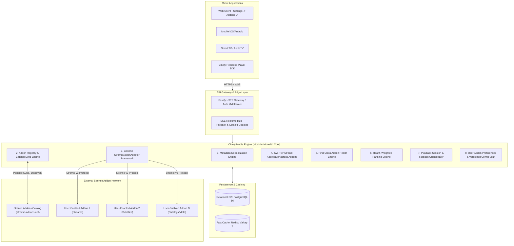
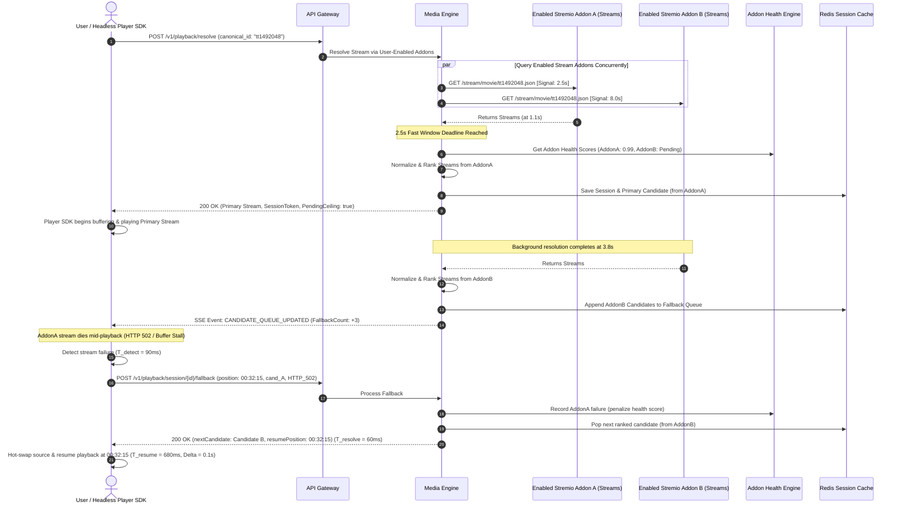

# Cinely: System Architecture & Subsystems Specification

## 1. High-Level System Architecture (V1 Modular Monolith)

Cinely V1 is architected as a **Modular Monolith** in TypeScript / Fastify. External stream and catalog discovery is exclusively powered by the **Stremio Addon Ecosystem**, managed through a generic adapter layer, an Addon Registry, and an Addon Health Engine.



---

## 2. Core Media Engine Subsystems

### 2.1 Subsystem 1: Metadata Normalization Engine
- **Purpose**: Normalizes metadata from authoritative catalogs (TMDB, TVMaze) and metadata-capable Stremio addons into uniform **Canonical Media Entities**.
- **Canonical Model**: Standardized URN (`cinely:item:mov_894721`), localized titles, release years, certifications, credits, seasons, episodes, and external ID mappings (`tmdb:`, `tt` IMDb, `kitsu:`).

### 2.2 Subsystem 2: Addon Registry & Catalog Sync Engine
- **Purpose**: Synchronizes, indexes, and manages available Stremio addons from `https://stremio-addons.net/addons`.
- **Authentic Taxonomy Preservation**:
  - Mirrors exact 16 categories (`anime`, `asian drama`, `bollywood`, `debrid support`, `http streams`, `live tv`, `metadata`, `misc`, `movies`, `music`, `nsfw`, `radios`, `subtitles`, `torrents`, `tv shows`, `usenet`).
  - Mirrors exact sort options (`popular`, `new`, `updatedAt`).
- **Dynamic Catalog Fetching**: Addons are fetched dynamically via catalog sync workers and cached with ETags; no hundreds of hard-coded addon URLs.

### 2.3 Subsystem 3: Generic `StremioAddonAdapter` Framework
- **Purpose**: Provides a universal, provider-agnostic implementation of the Stremio Addon Protocol v3.
- **Strict Anti-Branching Guarantee**: The adapter contains **zero provider-specific conditional branches** (e.g. no `if (torrentio)` or `if (comet)`). All behavior is driven purely by the addon's manifest:
  ```
  StremioAddonAdapter ──► Fetches Manifest (/manifest.json)
                              │
                              ├──► Inspects Declared Resources (catalog, meta, stream, subtitles)
                              ├──► Inspects Supported Types (movie, series, anime, etc.)
                              ├──► Inspects ID Prefixes (tt, tmdb:, kitsu:)
                              └──► Dispatches Resource Request (/<resource>/<type>/<id>[/<extra>].json)
  ```
- **Capability-Driven Execution**: Cinely only invokes resources (`stream`, `subtitles`, `meta`, `catalog`) explicitly declared in the addon's manifest.

### 2.4 Subsystem 4: Two-Tier Stream Aggregation Pipeline
- **Purpose**: Concurrently queries **user-enabled Stremio addons** that declare the `stream` resource for the requested media type and ID prefix:
  1. **Fast-Resolution Window (2.5 seconds)**: Gathers responses from all addons responding within 2.5s. Available streams are normalized, scored, and served immediately to start playback.
  2. **Hard Resolution Ceiling (5.0–8.0 seconds)**: Slower addons continue resolving in the background. Newly arrived candidates are merged into the Redis session fallback queue and broadcast via SSE.
  3. **Abort Signal**: Any addon call exceeding 8.0s is aborted via `AbortSignal`.

### 2.5 Subsystem 5: First-Class Addon Health Engine
- **Purpose**: Continuously monitors addon reliability, latency, and error budgets across all requests and player heartbeats.
- **Tracked Metrics per Addon**:
  - Sliding window success rate ($W_{\text{60s}}, W_{\text{15m}}, W_{\text{24h}}$).
  - Latency percentiles ($p_{50}, p_{95}, p_{99}$).
  - Error rate and circuit breaker states (`CLOSED`, `OPEN`, `HALF_OPEN`).
  - Playback stall and failure reports from client heartbeats.
- **Dynamic Ranking Integration**: Computes an active Addon Health Score $H_{\text{addon}} \in [0.0, 1.0]$ feeding directly into candidate ranking.

### 2.6 Subsystem 6: Playback Session & Fallback Orchestrator
- **Purpose**: Manages active playback leases and coordinates automated fallback across addon stream candidates.
- **Measurable Fallback Targets**:
  - Detection Latency ($T_{\text{detect}}$): $< 2,000\text{ms}$ (stall) / $< 100\text{ms}$ (fatal error).
  - Fallback Resolution Latency ($T_{\text{resolve}}$): $< 250\text{ms}$ (p95) from session cache.
  - Playback Resume Latency ($T_{\text{resume}}$): $< 1,500\text{ms}$ (p95).
  - Resume Position Delta ($\Delta_{\text{pos}}$): $\le 1.0\text{s}$.

### 2.7 Subsystem 7: User Addon Preferences & Versioned Configuration Vault
- **Purpose**: Persists user-selected addon toggles and encrypted custom addon configurations.
- **User Control Model**:
  - User explicitly enables/disables any addon.
  - Addon configuration parameters (e.g. Debrid API keys, stream resolution filters, custom transport URLs) are encrypted at rest using versioned AES-256-GCM.
  - Default addons are fully visible and can be toggled OFF or reset at any time.

---

## 3. End-to-End Sequence: Addon Stream Resolution & Resilient Fallback



---

## 4. Architectural Summary

1. **Stremio Addons as Sole Stream Mechanism**: All external stream discovery flows through user-enabled Stremio addons via `StremioAddonAdapter`.
2. **First-Class Settings → Addons**: Native support for browsing, filtering by 16 authentic categories, searching, configuring, and enabling/disabling addons.
3. **Generic & Manifest-Driven**: Zero hardcoded provider conditionals; capability inspection driven entirely by Stremio manifest.
4. **Resilient Two-Tier Timing & Health Ranking**: 2.5s fast window, 5–8s hard ceiling, dynamic health scoring, and measurable fallback SLAs.
