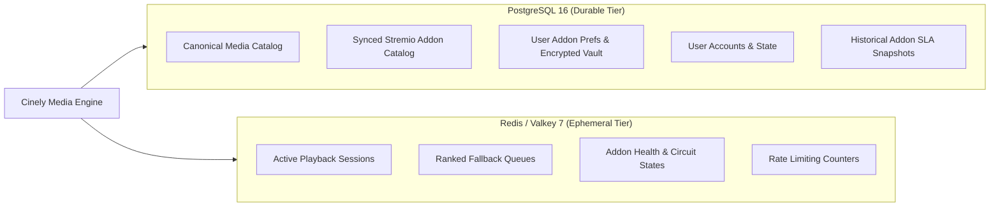

# Cinely: Database Architecture & Schema Specification

## 1. Storage Architecture & Multi-Tier Model

Cinely uses a hybrid persistence architecture:
- **Relational Persistence (PostgreSQL 16+)**: Stores durable entities (canonical catalog, synced Stremio addon catalog, user addon preferences with versioned encrypted configs, watch progress).
- **In-Memory Store (Redis / Valkey 7+)**: Manages active playback sessions, two-tier stream candidate queues, real-time addon circuit breaker states, and rate-limiting counters.



---

## 2. Relational Schema (PostgreSQL DDL)

### 2.1 Stremio Addon Catalog & User Preferences

```sql
CREATE EXTENSION IF NOT EXISTS "pg_trgm";
CREATE EXTENSION IF NOT EXISTS "uuid-ossp";

-- Synced Stremio Addons Catalog (from stremio-addons.net)
CREATE TABLE addon_catalog (
    id VARCHAR(128) PRIMARY KEY,               -- e.g. 'com.stremio.torrentio.addon'
    manifest_url TEXT NOT NULL,
    name VARCHAR(255) NOT NULL,
    version VARCHAR(50) NOT NULL,
    description TEXT,
    logo_url TEXT,
    background_url TEXT,
    types VARCHAR(50)[] NOT NULL,              -- ARRAY['movie', 'series', 'anime']
    resources JSONB NOT NULL,                  -- Array of declared resources/objects
    catalogs JSONB,                            -- Declared catalogs
    id_prefixes VARCHAR(50)[],                 -- ARRAY['tt', 'kitsu', 'tmdb:']
    categories VARCHAR(50)[] NOT NULL,         -- Array of the 16 authentic categories
    stars INT NOT NULL DEFAULT 0,
    is_configurable BOOLEAN NOT NULL DEFAULT FALSE,
    is_default BOOLEAN NOT NULL DEFAULT FALSE,
    raw_manifest JSONB NOT NULL,
    synced_at TIMESTAMPTZ NOT NULL DEFAULT NOW()
);

-- Trigram index for fast Addon search in Settings -> Addons
CREATE INDEX idx_addon_catalog_name_trgm ON addon_catalog USING gin (name gin_trgm_ops);
CREATE INDEX idx_addon_catalog_categories ON addon_catalog USING gin (categories);
CREATE INDEX idx_addon_catalog_types ON addon_catalog USING gin (types);

-- User Addon Preferences & Versioned Configuration Vault (AES-256-GCM)
CREATE TABLE user_addon_preferences (
    id UUID PRIMARY KEY DEFAULT gen_random_uuid(),
    user_id UUID NOT NULL REFERENCES users(id) ON DELETE CASCADE,
    addon_id VARCHAR(128) NOT NULL REFERENCES addon_catalog(id) ON DELETE CASCADE,
    is_enabled BOOLEAN NOT NULL DEFAULT TRUE,
    priority_order INT NOT NULL DEFAULT 100,
    key_version VARCHAR(10) NOT NULL DEFAULT 'v1',  -- Key version ('v1', 'v2')
    key_id VARCHAR(50) NOT NULL,                   -- Master key reference in KMS/Env
    nonce_iv BYTEA,                                -- 96-bit unique IV (NULL if unconfigured)
    auth_tag BYTEA,                                -- 128-bit GCM Auth Tag
    encrypted_config BYTEA,                        -- AES-256-GCM Encrypted config JSON
    created_at TIMESTAMPTZ NOT NULL DEFAULT NOW(),
    updated_at TIMESTAMPTZ NOT NULL DEFAULT NOW(),
    CONSTRAINT uq_user_addon UNIQUE (user_id, addon_id)
);
```

### 2.2 Addon Health & SLA Snapshots

```sql
-- Historical Addon Telemetry & SLA Snapshots
CREATE TABLE addon_health_snapshots (
    id UUID PRIMARY KEY DEFAULT gen_random_uuid(),
    addon_id VARCHAR(128) NOT NULL REFERENCES addon_catalog(id) ON DELETE CASCADE,
    snapshot_timestamp TIMESTAMPTZ NOT NULL DEFAULT NOW(),
    window_duration_seconds INT NOT NULL,
    success_rate_percent NUMERIC(5, 2) NOT NULL,
    p50_latency_ms INT NOT NULL,
    p95_latency_ms INT NOT NULL,
    p99_latency_ms INT NOT NULL,
    total_requests INT NOT NULL,
    error_count INT NOT NULL,
    stall_count INT NOT NULL,
    circuit_state VARCHAR(20) NOT NULL,           -- 'CLOSED', 'OPEN', 'HALF_OPEN'
    health_score NUMERIC(3, 2) NOT NULL
);
CREATE INDEX idx_addon_health_time ON addon_health_snapshots(addon_id, snapshot_timestamp DESC);
```

### 2.3 Canonical Media Catalog & User Progress

```sql
-- Canonical Media Entities
CREATE TABLE media_items (
    id VARCHAR(64) PRIMARY KEY,                    -- e.g. 'cinely:item:mov_894721'
    media_kind VARCHAR(20) NOT NULL,               -- 'movie', 'series', 'episode'
    original_title TEXT NOT NULL,
    default_title TEXT NOT NULL,
    overview TEXT,
    release_date DATE,
    release_year INT,
    runtime_minutes INT,
    certification VARCHAR(10),
    poster_url TEXT,
    backdrop_url TEXT,
    created_at TIMESTAMPTZ NOT NULL DEFAULT NOW(),
    updated_at TIMESTAMPTZ NOT NULL DEFAULT NOW()
);

-- External Provider Identifier Cross-References
CREATE TABLE media_external_mappings (
    id UUID PRIMARY KEY DEFAULT gen_random_uuid(),
    media_item_id VARCHAR(64) NOT NULL REFERENCES media_items(id) ON DELETE CASCADE,
    provider_name VARCHAR(50) NOT NULL,            -- 'imdb', 'tmdb', 'tvmaze', 'kitsu'
    external_id VARCHAR(128) NOT NULL,
    last_synced_at TIMESTAMPTZ NOT NULL DEFAULT NOW(),
    CONSTRAINT uq_provider_external_id UNIQUE (provider_name, external_id)
);

-- User Accounts
CREATE TABLE users (
    id UUID PRIMARY KEY DEFAULT gen_random_uuid(),
    email VARCHAR(255) UNIQUE NOT NULL,
    password_hash VARCHAR(255) NOT NULL,
    display_name VARCHAR(100) NOT NULL,
    role VARCHAR(20) NOT NULL DEFAULT 'user',
    created_at TIMESTAMPTZ NOT NULL DEFAULT NOW(),
    updated_at TIMESTAMPTZ NOT NULL DEFAULT NOW()
);

-- Watch Progress
CREATE TABLE user_watch_progress (
    id UUID PRIMARY KEY DEFAULT gen_random_uuid(),
    user_id UUID NOT NULL REFERENCES users(id) ON DELETE CASCADE,
    media_item_id VARCHAR(64) NOT NULL REFERENCES media_items(id) ON DELETE CASCADE,
    position_seconds NUMERIC(10, 2) NOT NULL DEFAULT 0,
    duration_seconds NUMERIC(10, 2) NOT NULL,
    is_completed BOOLEAN NOT NULL DEFAULT FALSE,
    last_watched_at TIMESTAMPTZ NOT NULL DEFAULT NOW(),
    CONSTRAINT uq_user_media_progress UNIQUE (user_id, media_item_id)
);
```

---

## 3. Ephemeral In-Memory Redis Schema

| Key Pattern | Structure | TTL | Purpose |
| :--- | :--- | :--- | :--- |
| `session:{sessionId}` | Hash | 6 Hours | Active session state, user ID, media ID, lease timestamp. |
| `session:{sessionId}:candidates` | Sorted Set / JSON | 6 Hours | Ranked stream candidates from enabled addons with fallback index. |
| `user:{userId}:active_addons` | Set | 1 Hour | Cached set of enabled addon IDs for fast resolution dispatch. |
| `health:addon:{addonId}` | Hash | 1 Hour | Rolling error counters, p50/p95 latency metrics, current health score. |
| `circuit:addon:{addonId}` | Hash | Dynamic | Circuit breaker state (`state`, `trippedAt`, `cooldownUntil`). |
| `cache:catalog:category:{cat}:{sort}:{page}` | JSON String | 1 Hour | Cached paginated catalog queries for Settings → Addons. |

---

## 4. Database Decisions Summary

1. **Addon Catalog Persistence**: Structured schema with JSONB manifest storage and GIN trigram indexing for high-speed Settings → Addons search.
2. **Versioned Credential Vault**: User configurations store `nonce_iv`, `auth_tag`, and `encrypted_config` supporting seamless master key rotation.
3. **Addon SLA Tracking**: `addon_health_snapshots` records historical performance for audit and health-weighted stream ranking.
