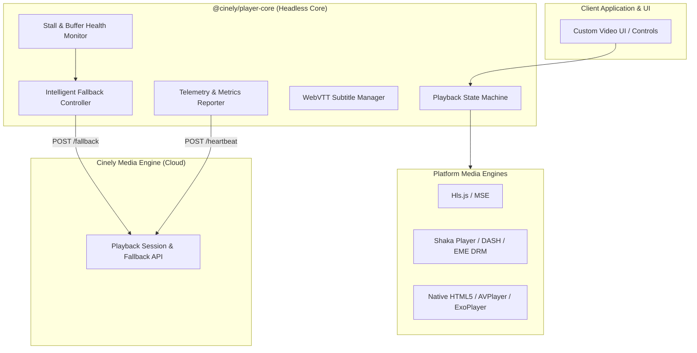
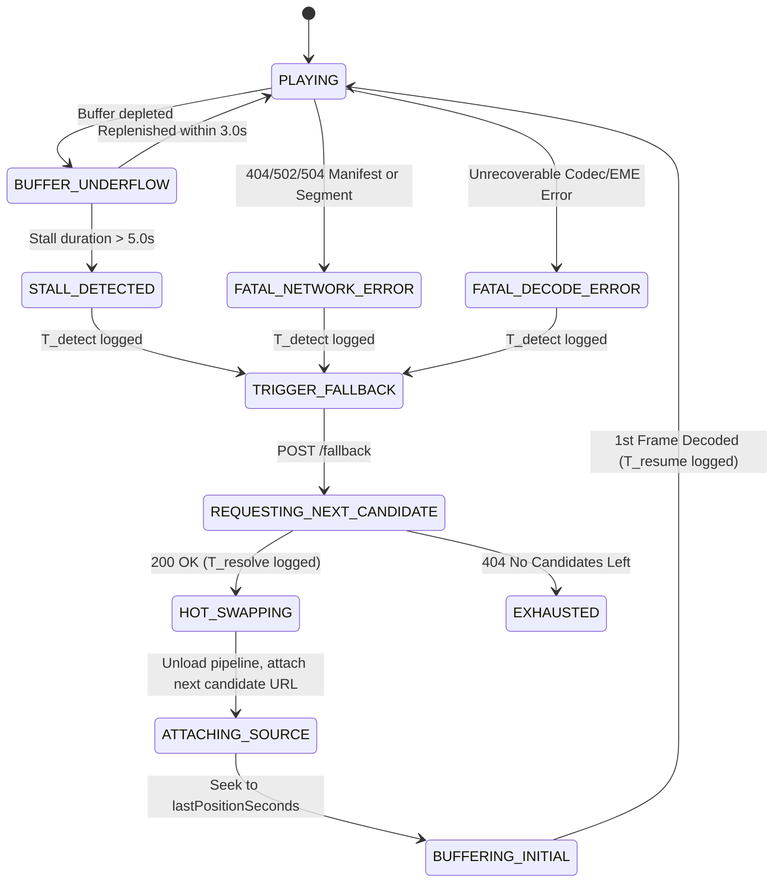

# Cinely: Player Architecture & Fallback Protocol Specification

## 1. Universal Headless Player Architecture

The Cinely Player architecture is built on a **Headless Player SDK** (`@cinely/player-core`). The SDK provides headless playback state management, buffer monitoring, quality adaptation, and resilient fallback coordination across any target platform (Web, iOS, Android, Smart TV).

Streams resolved from **user-enabled Stremio addons** are normalized by the Media Engine and delivered to the Player SDK as uniform playback candidates.



---

## 2. Measurable Best-Effort Fallback Protocol

When an active stream candidate (from Addon A) fails, the Player SDK transitions to the next ranked candidate (from Addon B) according to **4 quantifiable SLA fallback metrics**:

```
[ Stream Error Occurs on Addon A Stream ]
       │
       ├─► Detection Latency (T_detect): Time to identify fatal stall or 4xx/5xx
       │
[ POST /v1/playback/session/{id}/fallback ]
       │
       ├─► Fallback Resolution Latency (T_resolve): Time for Engine to pop candidate from Addon B
       │
[ Attach New Source & Buffer ]
       │
       ├─► Playback Resume Latency (T_resume): Time to decode & render 1st frame
       │
[ Playback Resumed at t_resume ] ──► Resume Position Delta (|t_resume - t_fail|)
```

### 2.1 Target Fallback SLA Metrics

| Metric | Definition | Target SLA (p95) |
| :--- | :--- | :--- |
| **Detection Latency ($T_{\text{detect}}$)** | Time from buffer exhaustion or network error to fallback trigger. | $< 2,000\text{ms}$ (buffer stall)<br>$< 100\text{ms}$ (HTTP 4xx/5xx / DRM) |
| **Fallback Resolution Latency ($T_{\text{resolve}}$)** | Latency for Media Engine to validate and return next candidate from Redis cache. | $< 250\text{ms}$ |
| **Playback Resume Latency ($T_{\text{resume}}$)** | Time to attach new manifest, parse playlist, download segment #1, and render first video frame. | $< 1,500\text{ms}$ (Broadband)<br>$< 2,500\text{ms}$ (Mobile/4G) |
| **Resume Position Delta ($\Delta_{\text{pos}}$)** | Absolute variance between stream failure timestamp and resumed timestamp: $|\text{Pos}_{\text{resume}} - \text{Pos}_{\text{failure}}|$. | $\le 1.0\text{ second}$ |

---

## 3. Fallback Classification & Handover State Machine



### 3.1 Handover Execution Steps
1. **Freeze State**: Record `lastKnownPosition = player.currentTime`, active subtitle language, and audio language.
2. **Dispatch Fallback Request**: Submit diagnostic telemetry (`errorCategory`, `detectionLatencyMs`, `bufferRemaining`) to `/v1/playback/session/{sessionId}/fallback`.
3. **Seamless Engine Switch**:
   - Cleanly detach the failing player engine instance.
   - Instantiate the appropriate engine for the replacement candidate (e.g. HLS vs DASH vs Direct MP4/MKV).
   - Inject source URL, custom headers, and DRM key system options.
   - Direct the player to start buffering from `lastKnownPosition`.
4. **Telemetry Feedback**: The subsequent heartbeat payload includes the observed $T_{\text{resume}}$ and $\Delta_{\text{pos}}$ to audit fallback health.

---

## 4. Player Assumptions Summary

1. **Measurable Fallback SLA**: Fallback performance is evaluated via explicit metrics ($T_{\text{detect}}$, $T_{\text{resolve}}$, $T_{\text{resume}}$, $\Delta_{\text{pos}}$).
2. **Headless Core**: Framework-agnostic TypeScript package (`@cinely/player-core`).
3. **Addon Agnosticism**: The Player SDK interacts purely with standardized `UnifiedStreamCandidate` payloads, completely decoupled from the originating Stremio addon.
