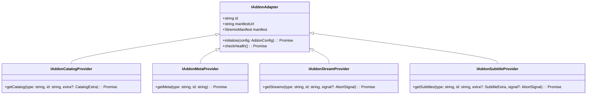

# Cinely: Stremio Addon Provider Architecture & Integration Specification

## 1. User-Control Principle & Provider Foundation

In Cinely V1, **Stremio-compatible addons are the exclusive external stream-provider mechanism**.

### 1.1 The User-Control Principle
Cinely adheres strictly to the **User-Control Principle**:
- **User Sovereignty**: The user has complete, uninhibited control over which Stremio addons are enabled, disabled, configured, or filtered.
- **No Gatekeeping**: Cinely does NOT impose its own content, quality, or provider restrictions on the user's addon choices. Cinely never blocks a stream or disables an addon because it considers the provider "unpreferred."
- **Platform-Only Invariants**: The only technical boundaries enforced by Cinely are those necessary for the operational and security integrity of the host server itself (e.g. blocking SSRF loopback/private cloud metadata probes, rate limiting, and authenticating user requests).
- **Initial Defaults are Optional**: Default addons are simply initial presets. Users can disable them completely and substitute any compatible Stremio community or private addon.



---

## 2. Addon Registry & Dynamic Catalog Synchronization

Cinely does not hardcode static lists of hundreds of addons. Instead, Cinely features an **Addon Registry** that dynamically discovers and synchronizes community and official addons from:

$$\text{Catalog Endpoint: } \texttt{https://stremio-addons.net/addons}$$

### 2.1 Authentic Taxonomy & Filtering Constraints
Cinely strictly mirrors the authentic filter dimensions and sorting options discovered from `stremio-addons.net`. Cinely **does not invent custom categories** (e.g. "Best", "Fastest", "4K", "Recommended"):

#### Supported Categories (Exact 16 Dimensions):
1. `anime`
2. `asian drama`
3. `bollywood`
4. `debrid support`
5. `http streams`
6. `live tv`
7. `metadata`
8. `misc`
9. `movies`
10. `music`
11. `nsfw`
12. `radios`
13. `subtitles`
14. `torrents`
15. `tv shows`
16. `usenet`

#### Supported Sorting Options (Exact 3 Options):
1. `popular` ("Popular") — Default
2. `new` ("New")
3. `updatedAt` ("Recently Updated")

### 2.2 Addon Manifest & Catalog Schema
```typescript
export interface StremioManifest {
  id: string;                      // e.g. "com.stremio.torrentio.addon"
  name: string;                    // e.g. "Torrentio"
  version: string;                 // e.g. "0.0.15"
  description: string;
  logo?: string;
  background?: string;
  types: Array<"movie" | "series" | "anime" | "tv" | "events" | "music" | "radio" | "other">;
  resources: Array<
    | "catalog"
    | "meta"
    | "stream"
    | "subtitles"
    | {
        name: "catalog" | "meta" | "stream" | "subtitles";
        types?: string[];
        idPrefixes?: string[];
      }
  >;
  catalogs: Array<{
    id: string;
    type: string;
    name: string;
    extra?: Array<{ name: string; isRequired?: boolean; options?: string[] }>;
  }>;
  idPrefixes?: string[];           // e.g. ["tt", "kitsu", "tmdb:"]
  behaviorHints?: {
    configurable?: boolean;
    configurationRequired?: boolean;
  };
  contactEmail?: string;
}
```

---

## 3. Generic `StremioAddonAdapter` Architecture

The `StremioAddonAdapter` is completely provider-agnostic. The Media Engine contains **zero provider-specific conditional code** (no `if (torrentio)` or `if (comet)`).

### 3.1 Capability Detection Matrix
When a media request arrives (e.g. Movie with IMDb ID `tt1492048`), the Adapter Engine inspects all **user-enabled addons**:

| Manifest Condition | Action Taken by Adapter Engine |
| :--- | :--- |
| Declares `"stream"` resource + supports `"movie"` type + (no `idPrefixes` OR `idPrefixes` includes `"tt"`) | **Eligible for Stream Query**: Dispatches `GET /stream/movie/tt1492048.json` |
| Declares `"subtitles"` resource + supports `"movie"` type | **Eligible for Subtitle Query**: Dispatches `GET /subtitles/movie/tt1492048.json` |
| Declares `"catalog"` resource + supports requested type/genre | **Eligible for Discovery Row**: Dispatches `GET /catalog/movie/{catalogId}.json` |
| Resource or Type NOT declared | **Skipped**: Addon is not invoked. |

### 3.2 Addon Configuration & Parameter Transport
- **Unconfigured Addons**: Query manifest directly at `https://addon.domain/manifest.json` and resources at `https://addon.domain/<resource>/<type>/<id>.json`.
- **Configured Addons**: User configuration parameters (e.g. Debrid credentials, sorting rules, provider exclusions) are serialized into the addon's configuration path:
  `https://addon.domain/<encrypted_or_encoded_config>/manifest.json`
  and resource queries follow:
  `https://addon.domain/<encrypted_or_encoded_config>/<resource>/<type>/<id>.json`

---

## 4. User Addon Lifecycle & Native In-App Settings → Addons

Cinely provides a first-class, **self-contained native in-app interface** for addon management:

```
Cinely Application
  └── Settings
        └── Addons
              ├── [ Search addons... ]
              ├── [ Filters: Categories (16) | Sort (3) ]
              ────────────────────────────────────────────────────────
              ├── Torrentio            [ ON  ]   [ Configure ]
              ├── Comet                [ OFF ]   [ Configure ]
              ├── MediaFusion          [ ON  ]   [ Configure ]
              ├── OpenSubtitles v3     [ ON  ]
              ────────────────────────────────────────────────────────
```

### 4.1 Native Browsing & Toggle Flow
1. **In-App Discovery**: The user browses, searches, and filters available addons directly inside Cinely without leaving the app. `stremio-addons.net` is queried on the backend as the catalog data source.
2. **Instant Toggle**: Addons can be toggled `ON` or `OFF` directly from the list. The state is instantly persisted to the user's preferences in the Media Engine.
3. **External Configuration Only When Required**:
   - For addons that require custom web-based setup (e.g. `configurable: true` in manifest), clicking **[ Configure ]** opens the addon's configuration page (e.g. `https://torrentio.strem.fun/configure`).
   - Once completed, the configured manifest URL is captured and stored directly into Cinely's encrypted vault.

### 4.2 Transparent Default Addons Set
To ensure out-of-the-box functionality upon first launch, Cinely initializes with a minimal set of open/public addons:
- OpenSubtitles v3 (Subtitles)
- Cinemeta / TMDB Catalog (Metadata & Catalog)
- Public Domain Media Addon (Public Domain Streams)

**User Sovereignty Guarantees**:
- All default addons are clearly visible in the **Installed / Enabled** list.
- The user can disable, reconfigure, or delete any default addon at any time.
- Cinely never silently installs or forces an addon ON.

---

## 5. Two-Tier Resolution & Candidate Normalization

### 5.1 Timing Workflow across Enabled Addons
1. **Tier 1: Fast Window (2.5s)**:
   - Queries all enabled stream addons concurrently with a 2.5s deadline.
   - Normalizes and ranks all stream candidates returned within 2.5s and delivers the primary stream immediately.
2. **Tier 2: Hard Ceiling (5.0–8.0s)**:
   - Slower addons continue in the background until 8.0s.
   - Returned candidates are normalized and appended to the active Redis fallback queue.
   - At 8.0s, all remaining open HTTP sockets are aborted via `AbortSignal`.

### 5.2 Stream Candidate Normalization Rules
Every stream returned by a Stremio addon (`{ url, title, name, description, behaviorHints }`) is normalized into Cinely's `UnifiedStreamCandidate`:

```typescript
export interface UnifiedStreamCandidate {
  candidateId: string;           // Deterministic UUID
  addonId: string;               // Originating Stremio addon ID
  addonName: string;             // Display name of originating addon
  sourceType: "hls" | "dash" | "mp4" | "webrtc" | "direct";
  streamUrl: string;             // Resolved stream URL or signed transport URL
  headers?: Record<string, string>;
  drmConfig?: {
    type: "widevine" | "fairplay" | "playready" | "clearkey";
    licenseServerUrl: string;
  };
  quality: {
    resolution: "4320p" | "2160p" | "1080p" | "720p" | "480p" | "auto";
    bitrateKbps?: number;
    codecVideo?: "av1" | "hevc" | "h264" | "vp9";
    codecAudio?: "aac" | "ac3" | "eac3" | "opus" | "flac";
    audioChannels?: number;
    hdrFormat?: "sdr" | "hdr10" | "dolby_vision";
  };
  subtitles: SubtitleTrackDescriptor[];
  addonHealthScore: number;      // Dynamic rating (0.00 - 1.00) from Addon Health Engine
}
```

---

## 6. First-Class Addon Health Engine & Ranking

The Addon Health Engine aggregates telemetry across all requests:

$$\text{CandidateScore} = S_{\text{resolution}} + S_{\text{codec}} + (H_{\text{addon}} \times 30) - (p_{95} \times 0.02) - P_{\text{penalties}}$$

- **Dynamic De-prioritization**: If an enabled addon's servers degrade ($H_{\text{addon}} < 0.60$), its streams are automatically ranked below healthy alternatives without removing the user's addon choice.
- **Circuit Breaking**: If an addon produces $\ge 5$ consecutive timeouts or $> 30\%$ error rates over 1 minute, its circuit trips to `OPEN` for 30 seconds to protect system responsiveness.

---

## 7. Mandatory 13-Vector Addon Contract Test Suite

Every generic addon integration and catalog manifest is validated against the **13-Vector Suite**:

| # | Test Vector | Stremio Protocol Assertion |
| :--- | :--- | :--- |
| **1** | **Manifest Ingestion** | Accurately parses `/manifest.json`, validates required fields (`id`, `name`, `version`, `resources`, `types`). |
| **2** | **Capability Filtering** | Confirms only declared resources and supported `idPrefixes` are queried; undeclared resources never called. |
| **3** | **Config Path Interpolation** | Correctly interpolates user parameters into `/<config>/manifest.json` and resource URLs. |
| **4** | **Stream Normalization** | Extracts resolutions (`4K`, `1080p`), codecs, bitrates, and subtitles from raw Stremio stream payloads. |
| **5** | **Subtitle Normalization** | Converts Stremio subtitle arrays (`lang`, `url`, `id`) into standardized WebVTT descriptors. |
| **6** | **Fast-Window Deadline (2.5s)** | Engine aggregates streams ready at 2.5s without blocking on slow addons. |
| **7** | **Hard Ceiling & Cancellation (8.0s)** | Successfully aborts hanging addon sockets via `AbortSignal` at 8.0s. |
| **8** | **Malformed Payloads** | Gracefully handles non-JSON responses, 404 HTML pages, and invalid schemas without engine errors. |
| **9** | **Rate Limiting (429)** | Respects `Retry-After` headers and pauses dispatch to rate-limited addon endpoints. |
| **10** | **Addon Outage (5xx)** | Emits typed `AddonOutageError` on 500/502/503/504 and updates the Addon Health Engine. |
| **11** | **Dead Stream Manifests** | Detects broken stream URLs during pre-flight checks and demotes candidate. |
| **12** | **Addon Health Reporting** | `checkHealth()` accurately measures manifest reachability and latency within $< 500\text{ms}$. |
| **13** | **Credential & Logging Safety** | Asserts zero leakage of user Debrid tokens or custom addon credentials in debug logs or telemetry. |
