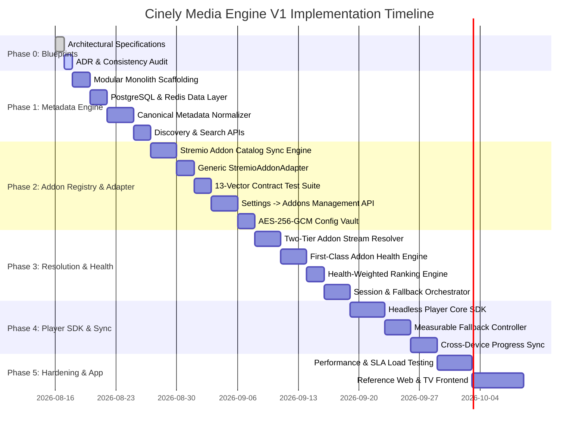

# Cinely: Engineering Roadmap & Implementation Plan

## 1. Phased Implementation Roadmap (V1 Modular Monolith)

---

## 2. Phase Deliverables & Acceptance Criteria

### Phase 0: Blueprints & Architecture Decision Records
- **Deliverables**: Comprehensive architecture docs (`PRODUCT.md`, `ARCHITECTURE.md`, `PROVIDERS.md`, `API.md`, `DATABASE.md`, `PLAYER.md`, `SECURITY.md`, `ROADMAP.md`) and `ADR.md`.
- **Milestone Exit**: Formal review and verification of architectural consistency.

---

### Phase 1: Core Engine & Canonical Metadata Subsystem
- **Key Deliverables**:
  1. TypeScript / Fastify modular monolith scaffolding with strict ESLint and TypeScript configs.
  2. PostgreSQL 16 migrations for canonical media entities, seasons, episodes, and mappings.
  3. Authoritative metadata ingestion (TMDB & TVMaze) for Cinely's canonical UI catalog.
  4. Canonical metadata normalizer with trigram fuzzy search.
  5. Discovery and Search REST APIs (`/v1/discover`, `/v1/search`, `/v1/media/{id}`).
- **Acceptance Criteria**:
  - Uncached search queries complete in $< 800\text{ms}$; cached queries in $< 50\text{ms}$.

---

### Phase 2: Stremio Addon Ecosystem & Settings → Addons
- **Key Deliverables**:
  1. **Addon Registry & Dynamic Catalog Sync**: Periodic synchronization from `https://stremio-addons.net/addons` preserving the 16 authentic categories and 3 sort options.
  2. **Generic `StremioAddonAdapter`**: Universal Stremio Addon Protocol v3 client driven purely by manifest capabilities.
  3. **13-Vector Addon Contract Test Suite** integrated into CI/CD.
  4. **Settings → Addons API**: Endpoints for browsing, filtering, searching, configuring, enabling, disabling, and resetting addons.
  5. **AES-256-GCM Config Vault**: Versioned envelope encryption for user addon parameters (Debrid API keys).
- **Acceptance Criteria**:
  - `GET /v1/addons/catalog?category=debrid+support&sort=popular` returns accurately filtered catalog records.
  - Generic adapter passes 100% of the 13 contract test vectors across sample Stremio manifests.

---

### Phase 3: Two-Tier Resolution, Addon Health & Fallback Orchestration
- **Key Deliverables**:
  1. Two-Tier Stream Resolver querying enabled stream addons (2.5s fast window, 5–8s hard ceiling, SSE background updates).
  2. **First-Class Addon Health Engine** with sliding window SLA metrics ($p_{50}, p_{95}, p_{99}$, error budgets).
  3. Health-Weighted Candidate Ranking Engine.
  4. Playback Session Manager (`/v1/playback/resolve`, `/v1/playback/session/{id}/heartbeat`).
  5. Resilient Fallback Orchestrator (`/v1/playback/session/{id}/fallback`).
- **Acceptance Criteria**:
  - Initial stream response dispatches within $\le 2,500\text{ms}$.
  - Fallback candidate pop from session cache executes in $< 250\text{ms}$ (p95).
  - Degraded addons ($H_{\text{addon}} < 0.60$) automatically deprioritized by the ranking engine.

---

### Phase 4: Headless Player Core SDK & Cross-Device State Sync
- **Key Deliverables**:
  1. Framework-agnostic `@cinely/player-core` TypeScript library.
  2. Buffer stall and error detection state machine.
  3. Seamless fallback handover controller with telemetry tracking ($T_{\text{detect}}$, $T_{\text{resolve}}$, $T_{\text{resume}}$, $\Delta_{\text{pos}}$).
  4. Real-time watch progress and watchlist synchronization APIs.
- **Acceptance Criteria**:
  - In automated player tests, induced stream dropouts trigger fallback with $T_{\text{detect}} < 2,000\text{ms}$, $T_{\text{resume}} < 1,500\text{ms}$, and position delta $\Delta_{\text{pos}} \le 1.0\text{s}$.

---

### Phase 5: Production Hardening & Reference Frontend
- **Key Deliverables**:
  1. Cinely Web and Smart TV reference client application with dedicated **Settings → Addons** interface.
  2. Performance stress testing under 10,000 active concurrent playback sessions.
  3. End-to-end security penetration audit.
- **Acceptance Criteria**:
  - Zero critical security findings; 99.9% uptime under load test.
